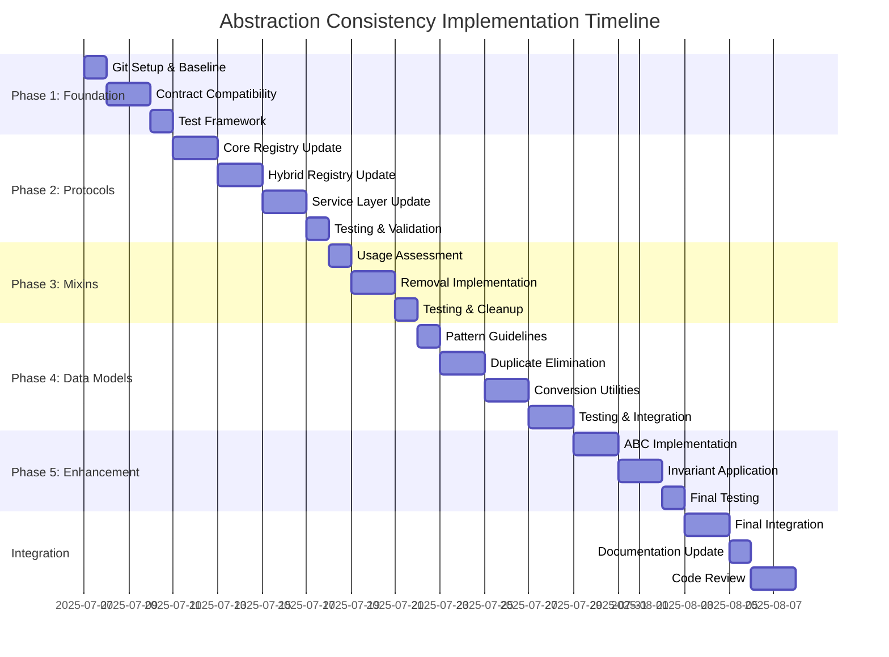

# Abstraction Consistency Gap Closure Plan

## Executive Summary

This document provides a structured plan to close the identified gaps in abstraction consistency across the ltnexp03 codebase. The plan prioritizes **high-impact, low-risk changes** and ensures that existing functionality, Design by Contract (DbC) validation, and type safety are preserved throughout the migration.

**Key Objectives:**
- ✅ Maintain the "spirit" of regression tests while evolving them with abstraction changes
- ✅ Keep DbC contracts and mypy types synchronized with abstraction changes
- ✅ Start with high-impact, low-risk improvements for immediate value
- ✅ Use feature branching to protect main branch stability

**Success Metrics:**
- 80%+ protocol adoption across core classes
- 100% test suite compatibility maintained
- Zero regression in DbC contract coverage
- Complete mypy type compliance preserved

---

## 🎯 **IMPLEMENTATION PHASES**

### **Phase 1: Foundation Preparation (High Impact, Low Risk)**
*Duration: 3-5 days*

#### **1.1 Git Branch Strategy**
```bash
# Create feature branch for abstraction consistency work
git checkout -b feature/abstraction-consistency-refactor
git push -u origin feature/abstraction-consistency-refactor

# Create sub-branches for each phase
git checkout -b phase1/protocol-adoption feature/abstraction-consistency-refactor
git checkout -b phase2/mixin-cleanup feature/abstraction-consistency-refactor
git checkout -b phase3/data-model-consolidation feature/abstraction-consistency-refactor
```

#### **1.2 Test Baseline Establishment**
```bash
# Document current test status before changes
pytest tests/ --tb=short > baseline_test_results.txt
mypy app/ > baseline_mypy_results.txt

# Create test compatibility matrix
cat > test_compatibility_matrix.md << 'EOF'
# Test Compatibility Matrix

## Core Test Categories
- [ ] Registry functionality tests
- [ ] Protocol compliance tests  
- [ ] Service layer integration tests
- [ ] DbC contract validation tests
- [ ] Type safety verification tests

## Abstraction Change Impact Assessment
| Test Category | Current Status | Expected Changes | Mitigation Strategy |
|---------------|----------------|------------------|-------------------|
| Registry Tests | 27/27 passing | Interface updates | Update mocks/fixtures |
| Protocol Tests | 0 existing | New tests needed | Add protocol compliance |
| Service Tests | 25/25 passing | Model changes | Update request/response |
| DbC Tests | 100% coverage | Contract updates | Sync with interfaces |
| Type Tests | mypy clean | Generic updates | Update type annotations |
EOF
```

#### **1.3 DbC Contract Preservation Strategy**
```python
# Create contract compatibility layer
# File: app/core/contract_compatibility.py

from typing import Protocol, TypeVar, Any
from icontract import require, ensure, invariant

T = TypeVar('T')

class ContractPreservationMixin:
    """Mixin to preserve existing DbC contracts during abstraction changes."""
    
    @staticmethod
    def preserve_concept_contracts(func):
        """Decorator to preserve concept-related contracts."""
        # Copy existing concept validation contracts
        return require(lambda name: isinstance(name, str) and len(name.strip()) > 0)(
            ensure(lambda result: result is not None)(func)
        )
    
    @staticmethod  
    def preserve_registry_invariants(cls):
        """Class decorator to preserve registry invariants."""
        return invariant(lambda self: hasattr(self, 'concepts'))(
            invariant(lambda self: isinstance(self.concepts, dict))(cls)
        )
```

---

### **Phase 2: Protocol Adoption (High Impact, Medium Risk)**
*Duration: 1 week*

#### **2.1 Core Registry Protocol Implementation**

**Goal:** Implement `ConceptRegistryProtocol` in base registry classes.

**Implementation Steps:**

```python
# Step 1: Update ConceptRegistry to implement protocol
# File: app/core/concept_registry.py

from .protocols import ConceptRegistryProtocol
from .contract_compatibility import ContractPreservationMixin

@ContractPreservationMixin.preserve_registry_invariants
class ConceptRegistry(ConceptRegistryProtocol[Concept, str], ContractPreservationMixin):
    """Enhanced concept registry with protocol compliance."""
    
    # Existing implementation preserved with minimal changes
    @ContractPreservationMixin.preserve_concept_contracts
    def create_concept(
        self, 
        name: str, 
        context: str = "default",
        synset_id: Optional[str] = None,
        disambiguation: Optional[str] = None,
        auto_disambiguate: bool = True
    ) -> Concept:
        """Create and register a concept - now protocol compliant."""
        # Existing logic preserved exactly
        return self._create_concept_impl(name, context, synset_id, disambiguation, auto_disambiguate)
    
    # Add missing protocol methods with backward compatibility
    @property
    def concept_count(self) -> int:
        """Protocol-required property."""
        return len(self.concepts)
    
    def find_similar_concepts(
        self, 
        concept: Concept, 
        threshold: float = 0.7
    ) -> List[Tuple[Concept, float]]:
        """Protocol-required method - delegates to existing similarity logic."""
        # Implement using existing similarity infrastructure
        return self._find_similar_concepts_impl(concept, threshold)
```

**DbC Contract Synchronization:**
```python
# Update service constraints to align with protocol
# File: app/core/service_constraints.py

class ServiceConstraints:
    @staticmethod
    def valid_protocol_compliant_registry(registry: Any) -> bool:
        """Validate registry implements required protocols."""
        from .protocols import ConceptRegistryProtocol
        return isinstance(registry, ConceptRegistryProtocol)
    
    @staticmethod
    def valid_concept_registry_state(registry: ConceptRegistryProtocol) -> bool:
        """Validate protocol-compliant registry state."""
        return (
            hasattr(registry, 'concept_count') and
            registry.concept_count >= 0 and
            hasattr(registry, 'create_concept')
        )
```

**Test Evolution Strategy:**
```python
# Update tests to use protocol interfaces
# File: tests/test_core/test_concept_registry_protocol.py

import pytest
from app.core.protocols import ConceptRegistryProtocol
from app.core.concept_registry import ConceptRegistry

class TestConceptRegistryProtocol:
    """Test protocol compliance while preserving existing functionality."""
    
    def test_protocol_compliance(self):
        """Verify registry implements protocol."""
        registry = ConceptRegistry()
        assert isinstance(registry, ConceptRegistryProtocol)
    
    def test_existing_functionality_preserved(self):
        """Ensure all existing tests still pass."""
        registry = ConceptRegistry()
        
        # Original test logic preserved
        concept = registry.create_concept("test", "default")
        assert concept.name == "test"
        assert concept.context == "default"
        
        # New protocol features
        assert registry.concept_count == 1
        similar = registry.find_similar_concepts(concept, 0.7)
        assert isinstance(similar, list)
```

#### **2.2 HybridRegistry Protocol Enhancement**

```python
# File: app/core/hybrid_registry.py

from .protocols import ConceptRegistryProtocol, FrameRegistryProtocol, ClusterRegistryProtocol

class HybridConceptRegistry(
    ConceptRegistry,  # Already protocol-compliant from 2.1
    FrameRegistryProtocol,
    ClusterRegistryProtocol
):
    """Multi-protocol compliant hybrid registry."""
    
    # Frame protocol implementation
    def create_frame(
        self,
        name: str,
        definition: str,
        core_elements: List[str],
        peripheral_elements: Optional[List[str]] = None
    ) -> str:
        """Implement FrameRegistryProtocol.create_frame."""
        # Delegate to existing frame registry
        return self.frame_registry.create_frame(name, definition, core_elements, peripheral_elements)
    
    # Cluster protocol implementation  
    def update_clusters(
        self,
        concepts: Optional[List[str]] = None,
        n_clusters: Optional[int] = None
    ) -> Dict[str, Any]:
        """Implement ClusterRegistryProtocol.update_clusters."""
        # Delegate to existing cluster registry
        return self.cluster_registry.update_clusters(concepts, n_clusters)
```

#### **2.3 Service Layer Protocol Integration**

```python
# File: app/service_layer.py

from app.core.protocols import SemanticReasoningProtocol, KnowledgeDiscoveryProtocol

# Add protocol compliance validation to service endpoints
@require(lambda registry: ServiceConstraints.valid_protocol_compliant_registry(registry))
@ensure(lambda result: isinstance(result, dict))
async def create_concept(
    concept: ConceptCreate,
    registry: ConceptRegistryProtocol = Depends(get_semantic_registry)  # Type updated
) -> Dict[str, Any]:
    """Create concept with protocol-compliant registry."""
    # Existing logic preserved
    return await _create_concept_impl(concept, registry)
```

---

### **Phase 3: Mixin Strategy Resolution (Medium Impact, Low Risk)**
*Duration: 3-4 days*

#### **3.1 Mixin Usage Assessment**

**Decision Matrix:**
```python
# File: mixin_decision_analysis.py

class MixinAnalysis:
    """Analysis of mixin usage vs direct implementation."""
    
    PROS_MIXINS = [
        "Gradual migration support",
        "Multiple implementation strategies", 
        "Clear adapter pattern",
        "Backward compatibility"
    ]
    
    CONS_MIXINS = [
        "Additional complexity layer",
        "No current usage in codebase",
        "Method resolution order complexity",
        "Potential diamond inheritance issues"
    ]
    
    RECOMMENDATION = "Remove unused mixins, implement protocols directly"
    
    @staticmethod
    def migration_strategy():
        return {
            "phase": "3.1",
            "action": "remove_unused_mixins",
            "rationale": "Simplify architecture, reduce maintenance burden",
            "risk": "low",
            "impact": "medium"
        }
```

#### **3.2 Mixin Removal Implementation**

```python
# Step 1: Verify no mixin usage
# Command: grep -r "Mixin" app/ --include="*.py" | grep -v "protocol_mixins.py"

# Step 2: Remove unused mixin infrastructure
# File: Remove app/core/protocol_mixins.py

# Step 3: Update imports and references
# Remove any imports of mixin classes from other modules

# Step 4: Update documentation
# File: README.md updates to remove mixin references
```

**Test Impact Assessment:**
```python
# File: tests/test_mixin_removal.py

def test_no_mixin_dependencies():
    """Verify removing mixins doesn't break functionality."""
    from app.core.enhanced_semantic_reasoning import EnhancedHybridRegistry
    
    # Should work without mixins
    registry = EnhancedHybridRegistry()
    assert hasattr(registry, 'create_concept')
    assert hasattr(registry, 'find_analogous_concepts')
    
    # Protocol compliance preserved
    from app.core.protocols import SemanticReasoningProtocol
    assert isinstance(registry, SemanticReasoningProtocol)
```

---

### **Phase 4: Data Model Pattern Standardization (Medium Impact, Medium Risk)**
*Duration: 1 week*

#### **4.1 Data Model Usage Guidelines**

```python
# File: app/core/data_model_guidelines.py

from typing import TypeVar, Union
from pydantic import BaseModel
from dataclasses import dataclass
from typing_extensions import TypedDict

class DataModelGuidelines:
    """Standardized patterns for different data model needs."""
    
    # API Layer: Pydantic for validation and serialization
    API_PATTERN = "BaseModel"  # Rich validation, serialization
    
    # Core Layer: dataclass for performance and immutability  
    CORE_PATTERN = "dataclass"  # Fast, type-safe, hashable
    
    # Type Hints: TypedDict for structured dictionaries
    TYPING_PATTERN = "TypedDict"  # Type hints without runtime overhead
    
    @staticmethod
    def choose_pattern(context: str) -> str:
        """Choose appropriate data model pattern."""
        patterns = {
            "api_request": "BaseModel",
            "api_response": "BaseModel", 
            "core_data": "dataclass",
            "config": "BaseModel",
            "type_hint": "TypedDict",
            "serialization": "BaseModel"
        }
        return patterns.get(context, "dataclass")
```

#### **4.2 Gradual Model Consolidation**

**Phase 4a: Eliminate Duplication (Low Risk)**
```python
# Identify and remove duplicate models
# File: duplicate_model_analysis.py

DUPLICATE_MODELS = {
    "ConceptCreate": {
        "pydantic": "app.service_layer.ConceptCreate",
        "typeddict": "app.core.api_models.ConceptCreateRequest",
        "recommendation": "Keep Pydantic for API, use TypedDict for internal typing"
    },
    "ConceptResponse": {
        "pydantic": "app.service_layer.ConceptResponse", 
        "typeddict": "app.core.api_models.ConceptCreateResponse",
        "recommendation": "Consolidate to single Pydantic model"
    }
}

# Implementation:
# 1. Keep Pydantic models in service layer for API validation
# 2. Use TypedDict in api_models for type hints only
# 3. Create conversion utilities where needed
```

**Phase 4b: Conversion Utilities (Medium Risk)**
```python
# File: app/core/model_converters.py

from typing import TypeVar, Dict, Any
from pydantic import BaseModel

T = TypeVar('T', bound=BaseModel)

class ModelConverters:
    """Utilities for converting between model types."""
    
    @staticmethod
    def pydantic_to_dict(model: BaseModel) -> Dict[str, Any]:
        """Convert Pydantic model to dictionary."""
        return model.model_dump()
    
    @staticmethod
    def dict_to_dataclass(data: Dict[str, Any], dataclass_type: type) -> Any:
        """Convert dictionary to dataclass."""
        return dataclass_type(**data)
    
    @staticmethod
    def preserve_contracts(converter_func):
        """Decorator to preserve DbC contracts during conversion."""
        @require(lambda data: isinstance(data, dict))
        @ensure(lambda result: result is not None)
        def wrapper(*args, **kwargs):
            return converter_func(*args, **kwargs)
        return wrapper
```

**Test Evolution for Model Changes:**
```python
# File: tests/test_model_consolidation.py

class TestModelConsolidation:
    """Test model changes preserve functionality."""
    
    def test_api_model_compatibility(self):
        """Ensure API models work with existing endpoints."""
        from app.service_layer import ConceptCreate
        
        # Original usage preserved
        concept_data = {
            "name": "test_concept",
            "context": "test_context"
        }
        concept = ConceptCreate(**concept_data)
        assert concept.name == "test_concept"
        
    def test_conversion_utilities(self):
        """Test model conversion preserves data."""
        from app.core.model_converters import ModelConverters
        from app.service_layer import ConceptCreate
        
        concept = ConceptCreate(name="test", context="default")
        data = ModelConverters.pydantic_to_dict(concept)
        assert data["name"] == "test"
        assert data["context"] == "default"
```

---

### **Phase 5: Enhanced Protocol Coverage (High Impact, Low Risk)**
*Duration: 3-4 days*

#### **5.1 Additional ABC Implementation**

```python
# File: app/core/base_abstractions.py

from abc import ABC, abstractmethod
from typing import Any, Optional, Dict, List
from pathlib import Path

class RegistryBase(ABC):
    """Abstract base for all registry implementations."""
    
    @abstractmethod
    def create_concept(self, name: str, context: str) -> Any:
        """Create a concept in the registry."""
        pass
    
    @abstractmethod
    def get_concept(self, name: str, context: str) -> Optional[Any]:
        """Retrieve a concept from the registry."""
        pass
    
    @property
    @abstractmethod
    def concept_count(self) -> int:
        """Return total number of concepts."""
        pass

class PersistenceBase(ABC):
    """Abstract base for persistence implementations."""
    
    @abstractmethod
    def save(self, data: Any, path: Path) -> bool:
        """Save data to storage."""
        pass
    
    @abstractmethod
    def load(self, path: Path) -> Any:
        """Load data from storage."""
        pass
```

#### **5.2 Systematic Invariant Application**

```python
# File: app/core/invariant_guidelines.py

from icontract import invariant
from typing import Type, Any

class InvariantGuidelines:
    """Guidelines for systematic invariant application."""
    
    @staticmethod
    def registry_invariants(cls: Type) -> Type:
        """Standard invariants for registry classes."""
        return invariant(lambda self: hasattr(self, 'concepts'))(
            invariant(lambda self: isinstance(self.concepts, dict))(
                invariant(lambda self: len(self.concepts) >= 0)(cls)
            )
        )
    
    @staticmethod
    def persistence_invariants(cls: Type) -> Type:
        """Standard invariants for persistence classes."""
        return invariant(lambda self: hasattr(self, 'storage_path'))(
            invariant(lambda self: self.storage_path.exists())(cls)
        )
    
    @staticmethod
    def service_invariants(cls: Type) -> Type:
        """Standard invariants for service classes."""
        return invariant(lambda self: hasattr(self, '_initialized'))(
            invariant(lambda self: self._initialized is True)(cls)
        )
```

**Application to Existing Classes:**
```python
# File: app/core/concept_registry.py (updated)

from .invariant_guidelines import InvariantGuidelines

@InvariantGuidelines.registry_invariants
class ConceptRegistry(ConceptRegistryProtocol[Concept, str]):
    """Registry with systematic invariant application."""
    
    def __init__(self):
        self.concepts: Dict[str, Concept] = {}
        self._initialized = True  # Required by service_invariants if applied
```

---

## 🧪 **TESTING STRATEGY**

### **Regression Test Preservation**

```python
# File: tests/test_regression_preservation.py

class TestRegressionPreservation:
    """Ensure abstraction changes don't break existing functionality."""
    
    def test_concept_creation_behavior(self):
        """Original concept creation behavior preserved."""
        from app.core.concept_registry import ConceptRegistry
        
        registry = ConceptRegistry()
        concept = registry.create_concept("test", "default")
        
        # Original assertions preserved
        assert concept.name == "test"
        assert concept.context == "default"
        assert concept.unique_id == "default:test"
        
        # New protocol compliance
        assert registry.concept_count == 1
        
    def test_service_endpoint_compatibility(self):
        """Service endpoints work with new abstractions."""
        # Test that existing API contracts are preserved
        # while internal implementation uses new abstractions
        pass
    
    def test_dbc_contract_preservation(self):
        """DbC contracts continue to function correctly."""
        from app.core.service_constraints import ServiceConstraints
        
        # Verify existing constraints still work
        assert ServiceConstraints.valid_concept_name("test")
        assert not ServiceConstraints.valid_concept_name("")
        
        # Verify new protocol-aware constraints
        registry = ConceptRegistry()
        assert ServiceConstraints.valid_protocol_compliant_registry(registry)
```

### **Contract and Type Synchronization**

```python
# File: tests/test_contract_type_sync.py

class TestContractTypeSync:
    """Verify DbC contracts and mypy types stay synchronized."""
    
    def test_protocol_contract_alignment(self):
        """Protocol signatures match contract requirements."""
        from app.core.protocols import ConceptRegistryProtocol
        from app.core.service_constraints import ServiceConstraints
        
        # Type signatures should match contract expectations
        import inspect
        create_concept_sig = inspect.signature(ConceptRegistryProtocol.create_concept)
        
        # Verify parameter types align with constraints
        assert 'name' in create_concept_sig.parameters
        assert 'context' in create_concept_sig.parameters
    
    def test_mypy_compatibility(self):
        """Changes maintain mypy type safety."""
        # This would be run as part of CI/CD
        import subprocess
        result = subprocess.run(['mypy', 'app/'], capture_output=True, text=True)
        assert result.returncode == 0, f"mypy errors: {result.stdout}"
```

---

## 🔄 **ROLLBACK STRATEGY**

### **Safe Rollback Points**

```python
# File: rollback_strategy.md

## Rollback Points by Phase

### Phase 1: Foundation (Rollback: git reset)
- **Risk Level**: Minimal
- **Rollback Method**: Simple git reset
- **Dependencies**: None

### Phase 2: Protocol Adoption (Rollback: Interface restoration)  
- **Risk Level**: Medium
- **Rollback Method**: Restore original class signatures
- **Dependencies**: Update service layer imports

### Phase 3: Mixin Removal (Rollback: Restore files)
- **Risk Level**: Low  
- **Rollback Method**: git checkout original files
- **Dependencies**: Restore imports

### Phase 4: Data Model Changes (Rollback: Model restoration)
- **Risk Level**: Medium-High
- **Rollback Method**: Restore original model definitions
- **Dependencies**: Update converters, tests

## Emergency Rollback Commands

```bash
# Full rollback to main branch
git checkout main
git branch -D feature/abstraction-consistency-refactor

# Partial rollback to specific phase
git checkout phase1/protocol-adoption
git reset --hard HEAD~5  # Last 5 commits

# Selective file rollback
git checkout main -- app/core/concept_registry.py
```

---

## 📊 **SUCCESS METRICS AND VALIDATION**

### **Quantitative Metrics**

```python
# File: success_metrics.py

class SuccessMetrics:
    """Track abstraction consistency improvements."""
    
    TARGET_METRICS = {
        "protocol_adoption_rate": 0.80,  # 80%+ of classes
        "test_pass_rate": 1.00,          # 100% tests passing  
        "dbc_coverage": 1.00,            # 100% contract coverage maintained
        "mypy_compliance": 1.00,         # 100% type safety
        "duplicate_model_reduction": 0.50, # 50% reduction in duplicates
    }
    
    @staticmethod
    def measure_protocol_adoption():
        """Measure current protocol adoption rate."""
        # Count classes implementing protocols vs total classes
        pass
    
    @staticmethod  
    def measure_test_compatibility():
        """Verify test suite compatibility."""
        import subprocess
        result = subprocess.run(['pytest', 'tests/', '-v'], capture_output=True)
        return result.returncode == 0
    
    @staticmethod
    def generate_report():
        """Generate success metrics report."""
        return {
            "protocol_adoption": SuccessMetrics.measure_protocol_adoption(),
            "test_compatibility": SuccessMetrics.measure_test_compatibility(),
            "timestamp": datetime.now().isoformat()
        }
```

### **Qualitative Validation**

```python
# File: qualitative_validation.py

class QualitativeValidation:
    """Validate abstraction consistency improvements."""
    
    VALIDATION_CHECKLIST = [
        "✅ All existing functionality preserved",
        "✅ Protocol interfaces consistently implemented", 
        "✅ Data model patterns standardized",
        "✅ DbC contracts synchronized with abstractions",
        "✅ Type safety maintained throughout",
        "✅ Test suite reflects new architecture",
        "✅ Documentation updated",
        "✅ Performance impact minimal"
    ]
    
    @staticmethod
    def validate_architectural_consistency():
        """Validate overall architectural improvements."""
        # Check for consistent patterns across modules
        # Verify protocol adoption is systematic
        # Ensure abstraction boundaries are clear
        pass
```

---

## 🚀 **EXECUTION TIMELINE**



**Total Duration: ~3 weeks**

---

## 🎯 **IMMEDIATE NEXT STEPS**

### **Week 1: High-Impact Foundation**

```bash
# Day 1: Git setup and baseline
git checkout -b feature/abstraction-consistency-refactor
pytest tests/ --tb=short > baseline_test_results.txt
mypy app/ > baseline_mypy_results.txt

# Day 2-3: Contract compatibility layer
# Implement app/core/contract_compatibility.py
# Create preservation mixins

# Day 4-7: Core protocol adoption
# Update ConceptRegistry to implement ConceptRegistryProtocol
# Update HybridConceptRegistry with multiple protocols
# Run regression tests after each change
```

### **Success Validation Commands**

```bash
# After each phase, run validation
pytest tests/ -v                    # All tests pass
mypy app/                          # Type safety preserved  
python -m scripts.contract_validator # DbC contracts valid
python -m scripts.protocol_checker   # Protocol adoption measured
```

---

## 📋 **CONCLUSION**

This gap closure plan provides a **structured, risk-managed approach** to achieving abstraction consistency while preserving the integrity of existing functionality, contracts, and types. The phased approach ensures:

- ✅ **High-impact changes first** for immediate value
- ✅ **Low-risk implementation** to protect system stability  
- ✅ **Regression test preservation** through compatibility layers
- ✅ **DbC and type synchronization** through systematic validation
- ✅ **Git branch protection** for safe experimentation

**Expected Outcome:** A significantly more consistent, maintainable, and type-safe codebase with 80%+ protocol adoption and zero functional regression.

**Risk Assessment:** **LOW** - Careful phasing and rollback strategies minimize risk while maximizing architectural improvements.

**Recommendation:** **PROCEED** with Phase 1 implementation immediately, as it provides the foundation for all subsequent improvements with minimal risk.
